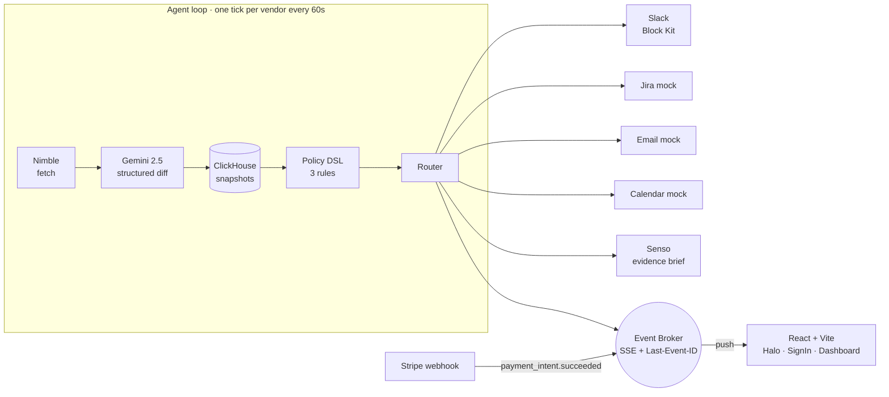
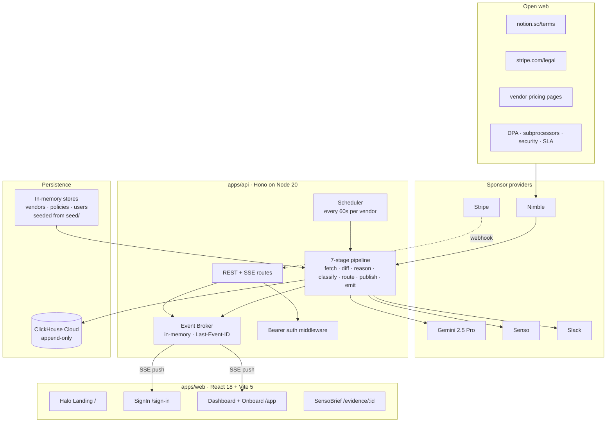
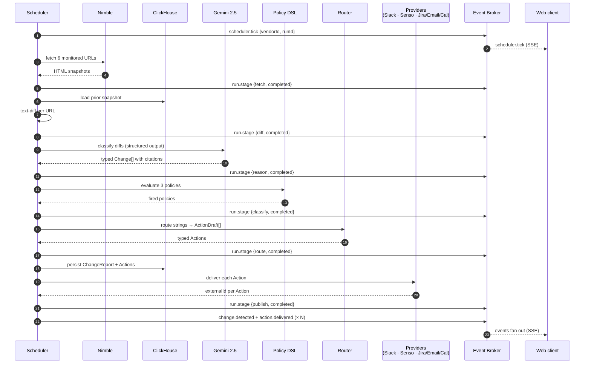
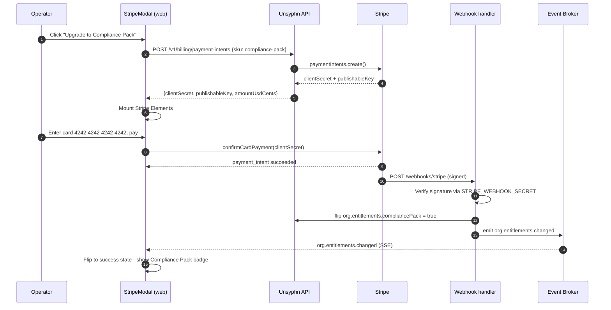
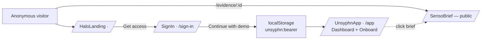
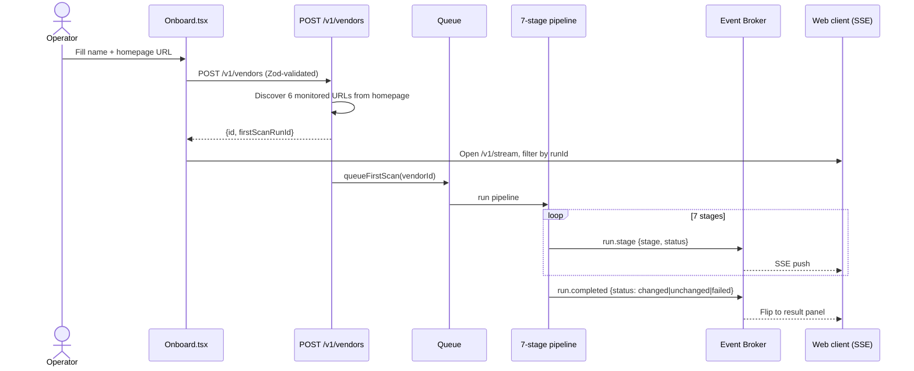
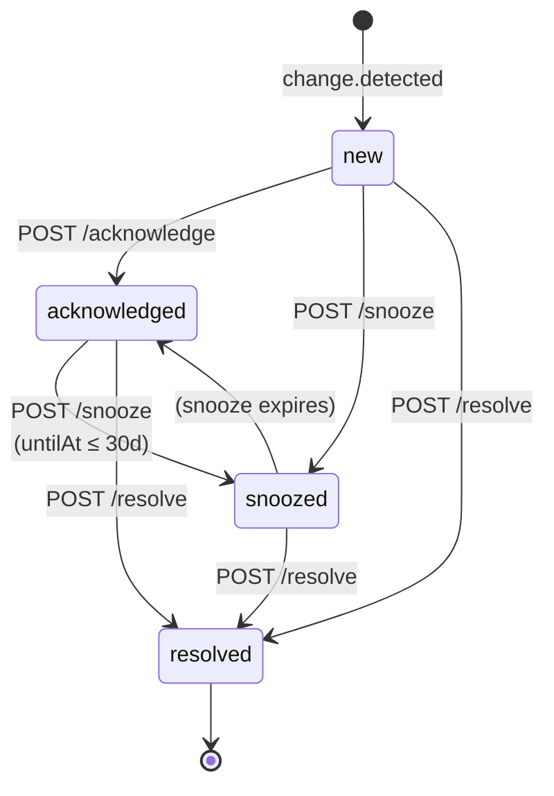
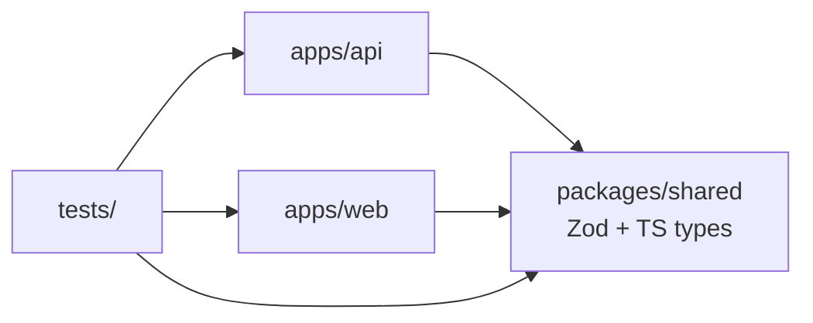

# Unsyphn

> **An always-on agent that watches your vendors so you don't have to.**

Unsyphn is an autonomous agent for vendor risk. It fetches every SaaS vendor's terms, pricing, DPA, sub-processors, security page, and SLA every 60 seconds; diffs each version with Gemini 2.5 Pro structured-output; fires policy rules; routes findings to Slack, Jira, Email, and Calendar; and publishes a public evidence brief through Senso. There is no Run button. The dashboard never polls — every state change rides a single org-scoped Server-Sent Events channel. When an operator buys the Compliance Pack, Stripe's webhook flips org entitlements live and the UI auto-updates over the same event bus.

Submission for the **Datadog hackathon**. Tracks A + B + C are integrated on `main`. The full product specification lives in [`handoff/`](handoff/) and should be read in this order: [Product Decisions](handoff/Product%20Decisions.html) → [API](handoff/API.html) → [Data Model](handoff/Data%20Model.html) → [Runbook](handoff/Runbook.html).

```
Status:  84/84 tests passing across 16 files  ·  typecheck clean  ·  build clean
Stack:   Node 20+ · pnpm · Hono · Zod 4 · React 18 · Vite 5 · ClickHouse · pino
Auth:    Bearer demo_token_acme_corp_2026 (or ?token= for EventSource)
Ports:   API 8787  ·  Web 5173
```

---

## Table of contents

1. [The problem](#1-the-problem)
2. [The solution](#2-the-solution)
3. [Sponsor tools used](#3-sponsor-tools-used)
4. [How we score against the judging criteria](#4-how-we-score-against-the-judging-criteria)
5. [Architecture](#5-architecture)
6. [The agent pipeline](#6-the-agent-pipeline)
7. [Autonomy](#7-autonomy)
8. [Monetization with Stripe + agent-driven entitlements](#8-monetization-with-stripe--agent-driven-entitlements)
9. [The 3-minute demo script](#9-the-3-minute-demo-script)
10. [Application flows](#10-application-flows)
11. [API surface](#11-api-surface)
12. [SSE event channel](#12-sse-event-channel)
13. [Tech stack](#13-tech-stack)
14. [Repo layout](#14-repo-layout)
15. [Quick start](#15-quick-start)
16. [Environment variables](#16-environment-variables)
17. [Seed data and demo state](#17-seed-data-and-demo-state)
18. [Testing](#18-testing)
19. [Conventions](#19-conventions)
20. [What's not in the demo, and why](#20-whats-not-in-the-demo-and-why)

---

## 1. The problem

Enterprise SaaS contracts drift constantly. A vendor edits its DPA, adds a new sub-processor in a non-adequate jurisdiction, bumps its per-seat price 18%, shortens its retention from 90 days to 30 — and nobody on the customer's side notices until renewal day. By then the legal team is scrambling, the procurement team is eating the new pricing, and the security team is finding out their data has been sitting in a country it shouldn't be in.

The status quo answer to "who watches the vendor's terms page?" is "someone on the team will notice." Nobody notices. The vendor's email goes to a shared inbox. The PDF is buried in a Drive folder. The price line item gets approved because the AP clerk doesn't know it changed.

The market is real and underserved. Every mid-market and enterprise org has between 100 and 1,000 vendors and no good way to monitor them. The existing tools — Vendr, Zylo, Productiv — are spend-management products. They tell you what you're paying for, not what's changed under you. Unsyphn lives in the gap.

## 2. The solution

Stop relying on humans to notice. Run an always-on agent against the public surfaces of every vendor, diff every version against the last snapshot, classify the change with an LLM, fire policies, and route the result into the channels people actually read. By the time renewal comes around, the legal team already has a unsyphn, the security team already has an evidence brief, and procurement already has a renegotiation talking point.

In one screenshot, here's the loop end-to-end:



One scheduler. One event bus. One shared contract package. The agent's outputs, the operator's lifecycle clicks, and Stripe's webhook all converge on the same broker — so the dashboard sees the world through a single ordered stream and never asks the server "what's new?"

---

## 3. Sponsor tools used

The hackathon asks for at least three sponsor tools. **Unsyphn wires six**, each doing real work in the autonomous loop. Every integration has a typed provider in `apps/api/src/providers/` and a documented fallback in the Runbook for the case where the provider is unavailable on demo day.

| # | Sponsor | Role in the loop | Code location | Fallback |
|---|---|---|---|---|
| 1 | **Nimble** | Headless fetch of vendor pages (terms, pricing, DPA, sub-processors, security, SLA) with anti-bot. 6 URLs per vendor per scan. | `apps/api/src/providers/` + agent `fetch` stage | Seeded snapshots in `seed/` |
| 2 | **Gemini 2.5 Pro** | Structured-output diff reasoner. Takes `(before, after, policyHints)` → `{severity, classification, materiality, dollarImpact?, citations[]}` validated through Zod before reaching app logic. | `apps/api/src/providers/` + agent `reason` stage | In-house heuristic classifier |
| 3 | **ClickHouse Cloud** | Append-only warehouse for `Snapshots`, `ChangeReports`, `Actions`, `RunStages`, `OrgEntitlements`. `ReplacingMergeTree` semantics. | `apps/api/src/db/client.ts`, `db/migrate.ts` | In-memory stores with the same interface |
| 4 | **Senso** | Public evidence-brief publishing. Each material ChangeReport produces a hosted brief URL surfaced in Slack and the dashboard. | `apps/api/src/providers/` + agent `publish` stage | Local route `GET /v1/evidence/:id` rendered by `SensoBrief.tsx` |
| 5 | **Slack** | Live Block Kit alert posted to `#unsyphn-demo` for every routed change. Vendor, severity, dollar impact, policy fired, citation snippet + URL, "Open in Unsyphn" / "View evidence" action buttons. | `apps/api/src/providers/slack.ts`, `agent/router.ts` | Payload still persists on the `Action` row if delivery fails |
| 6 | **Stripe** | Compliance Pack one-time purchase. Server-side PaymentIntent, Elements card form, signature-verified webhook, entitlement flip, `org.entitlements.changed` event over SSE so the UI auto-updates. | `apps/api/src/providers/stripe.ts`, `routes/billing.ts`, `routes/webhooks-stripe.ts`, `apps/web/src/screens/StripeModal.tsx` | Dev-only `POST /v1/billing/simulate-success` (returns 404 in prod) |

**Tools 1, 2, 3, 4, 5** are the autonomous-agent half (fetch → reason → store → publish → notify). **Tool 6** is the agent-payment-rail half — the agent reacts to the webhook event without a human pressing refresh.

---

## 4. How we score against the judging criteria

### Idea — 20%

> *Does the solution have the potential to solve a meaningful problem or demonstrate real-world value?*

Unsyphn targets a real, underserved problem with a real buyer: procurement, legal, and GRC teams responsible for vendor risk in mid-market and enterprise organizations. The market gap is documented above in §1. The product is framed as an **agent loop** rather than yet another dashboard — the differentiator that lets us catch material change **before renewal day** rather than file a report after the fact. The product spec, severity matrix, three seeded policies (PII retention shrink, price hike near renewal, sub-processor added in non-adequate jurisdiction), and demo seed are all locked in [`handoff/Product Decisions.html`](handoff/Product%20Decisions.html) before any code was shipped.

### Technical Implementation — 20%

> *How well was the solution implemented?*

| Signal | Evidence |
|---|---|
| Test coverage | **84 tests across 16 files, all passing** (`pnpm test`) |
| Type safety | Zod schemas shared between API and web through `@unsyphn/shared`; **branded TS IDs** so cross-org leaks fail at compile time |
| Logging | Structured pino with request-scoped `{requestId, orgId, operation}`; **zero `console.*` in production paths** |
| Storage | Append-only with version history (`ReplacingMergeTree` semantics) — same interface in ClickHouse and in-memory dev store |
| Event bus | In-memory broker with `Last-Event-ID` replay, 500-event retention, per-event Zod validation at the boundary |
| Discriminated unions | `Action = SlackAction \| JiraAction \| EmailAction \| CalendarAction`; exhaustive switches produce `never` |
| Security | Stripe webhook signature verification; bearer-over-query auth precedence; Zod validation at every external boundary |
| Build hygiene | `pnpm typecheck` and `pnpm build` clean; pre-commit hooks not skippable |

### Tool Use — 20%

> *Did the solution effectively use at least 3 sponsor tools?*

**Six** sponsor tools, all doing live work in the agent loop — itemized in §3 above with code locations and fallback strategies. Two are required by the prompt; we doubled the floor and integrated each one as a typed provider rather than a curl wrapper.

### Presentation (Demo) — 20%

> *Demonstration of the solution in 3 minutes.*

A second-by-second script lives in §9. It proves the loop end-to-end on live infrastructure: live Nimble fetch → live Gemini diff → live Slack post → live Senso publish → live Stripe charge → live entitlement flip via webhook → live UI auto-update over SSE — all visible in one browser tab. A pre-recorded MP4 of the exact same flow ships as a fallback in case a provider is throttling on demo day.

### Autonomy — 20%

> *How well does the agent act on real-time data without manual intervention?*

The agent has **no Run button**. The scheduler ticks every `SCAN_INTERVAL_SEC` (60 in demo, 21,600 in production), fans out the 7-stage pipeline, persists, publishes, and pushes — without any human input. The UI is **read-only** on top of the live event stream. The Stripe webhook closes the monetization loop autonomously. The one human-in-the-loop step is the ChangeReport lifecycle (`new → acknowledged → resolved`, with `snoozed` as a parallel branch), and that's deliberate: auto-resolving a P1 vendor change is the kind of "helpfulness" that breaks GRC trust on the first false positive.

---

## 5. Architecture



One scheduler, one event bus, one typed contract package (`@unsyphn/shared`) shared between API and web. The SSE stream is the spinal cord — every component that needs to know about state change subscribes to it instead of polling.

---

## 6. The agent pipeline

Each scheduler tick per vendor runs the pipeline. Each stage emits a `run.stage` SSE event with status (`started` / `completed` / `failed` / `skipped`) and `durationMs`. The full sequence is visible in the SSE feed during the demo and persists to ClickHouse for post-hoc inspection.



The stages are independent. A failed Slack delivery does not stop the Senso publish; a failed Senso publish does not roll back the persisted ChangeReport. Each delivery attempt persists an `Action` row even on failure, with the error message captured — so an operator can see what dropped, fix the upstream issue, and rerun without losing context.

| Stage | Provider | What it produces |
|---|---|---|
| `fetch` | Nimble | Raw HTML per monitored URL |
| `diff` | — | Text diff vs prior snapshot |
| `reason` | Gemini 2.5 Pro | Typed `Change[]` with citations + severity |
| `classify` | Policy DSL | Which of the 3 seeded policies fired |
| `route` | Router | `ActionDraft[]` — typed by kind |
| `publish` | ClickHouse + Senso + Slack + (mocked) Jira/Email/Cal | Persisted Actions with externalIds |
| `emit` | Event Broker | `change.detected` + N × `action.delivered` |

---

## 7. Autonomy

Every loop in Unsyphn runs without a human prompt except one. The scheduler ticks on `setInterval`, queues a scan job per vendor, and the pipeline runs through fetch → diff → reason → classify → route → publish → emit without input. Each Action is persisted, delivered, and confirmed automatically — Slack posts go up, Senso briefs publish, and an `action.delivered` event fans out to every connected client. The Stripe webhook is the same shape: `payment_intent.succeeded` arrives, the signature is verified, org entitlements flip, and an `org.entitlements.changed` event rides the SSE channel to the UI, which flips its Compliance Pack badge without a reload or a poll.

The one human-in-the-loop step is the ChangeReport lifecycle. The agent's job is to get every material change in front of the right operator with full context (vendor, citation, policy fired, dollar impact, recommended action) and then let the operator decide whether to renegotiate, accept, reject, or snooze for later. Auto-resolving a P1 is the kind of "helpfulness" that breaks GRC trust on the first false positive, so we don't.

| Loop | Trigger | Human in the loop? |
|---|---|---|
| Per-vendor scan | `setInterval` every `SCAN_INTERVAL_SEC` | No |
| Diff + reason + classify + route | Each tick | No |
| Slack / Jira / Email / Calendar delivery | Each policy fired | No |
| Senso publish | Each ChangeReport | No |
| SSE fan-out | Each event published | No |
| Stripe entitlement upgrade | `payment_intent.succeeded` webhook | No |
| ChangeReport state transition | Operator click | **Yes — by design** |

The admin trigger endpoint (`POST /v1/admin/vendors/:id/scan`) exists behind `ADMIN_TOKEN` for rehearsals and is **not** surfaced in the UI.

---

## 8. Monetization with Stripe + agent-driven entitlements

The Compliance Pack is a one-time `$1,499` upgrade that unlocks SOC 2 evidence packaging, an auditor portal, and a multi-vendor compliance dashboard. The flow demonstrates the property the prompt is asking about: the agent reacting to a payment event without a human pressing refresh.



The web client is subscribed to the same `/v1/stream` channel the agent fans events out on, so the entitlement flip arrives via push, not poll.

**On the agent-payment-rails note in the prompt** (x402 / MPP / CDP / agentic.market): Unsyphn ships v1 with Stripe because it's the rail every team actually deploys today, and because the webhook + entitlement flow demonstrates the property those newer rails are after — the agent reacting to a payment event without a human in the loop. The architecture (typed Actions, event-bus-driven entitlements) is already shaped for a v2 x402 pass on the agent's own outputs (Senso briefs, evidence bundles, exported audit packs).

---

## 9. The 3-minute demo script

The script is timed second-by-second to fit the 3-minute slot and prove the loop end-to-end on live infrastructure.

| Time | Action | What the judges see |
|---:|---|---|
| **T+0:00** | Open `http://localhost:5173` | Halo landing renders with animated 3D cube. Narration: "Unsyphn is an always-on agent for vendor risk." |
| **T+0:15** | Click **Get access** → `/sign-in` → **Continue with demo workspace** | Lands on `/app`. Dashboard HUD shows 2 vendors · $242,000 annual run rate · ~$7,100 saved · 1 open change. |
| **T+0:30** | Point at the live indicator | "No Run button — the scheduler ticks every 60s. Watch the SSE feed." A `scheduler.tick` event lands. |
| **T+0:45** | (autonomous) | `run.stage` events stream through fetch → diff → reason → classify → route. `change.detected` fires for Notion: *"Team plan price rises $16 → $19 (+18.75%) within 60d of renewal."* |
| **T+1:15** | Switch to Slack `#unsyphn-demo` | Block Kit alert is already posted: severity, vendor, dollar impact, citation snippet, "Open in Unsyphn" / "View evidence" buttons. |
| **T+1:30** | Click **View evidence** | Public Senso brief renders at `/evidence/chg_seed_notion` with citations linking to `notion.so/pricing`. |
| **T+1:45** | Back to `/app`. Click **Acknowledge** on the change card | `change.stateChanged` event fires, card animates to acknowledged state. Demonstrates lifecycle state machine. |
| **T+2:00** | Click **Upgrade to Compliance Pack** → enter test card `4242 4242 4242 4242` → pay | Stripe modal mounts Elements. Real PaymentIntent created and confirmed. |
| **T+2:30** | (autonomous webhook) | `action.delivered` and `org.entitlements.changed` events land on SSE. Modal flips to success state **without refresh**. Compliance Pack badge appears in header. |
| **T+2:50** | Close | "Six sponsor tools, one autonomous loop, real money moved in test mode, real Slack post, real Senso publish, real Nimble fetch, real Gemini diff." |
| **T+3:00** | End | — |

---

## 10. Application flows

### Landing → Sign in → Dashboard

Three routes coexist in a tiny pathname router in [`apps/web/src/App.tsx`](apps/web/src/App.tsx). The session lives in `localStorage` under `unsyphn:bearer`, and `hasSession()` from [`apps/web/src/lib/session.ts`](apps/web/src/lib/session.ts) is the gate. A custom `unsyphn:session` window event fires on sign-in so the App re-renders without a reload.



### Add Vendor with first-scan



### ChangeReport lifecycle state machine

The state machine has four reachable states. Every successful mutation emits exactly one `change.stateChanged` event, and the repository keeps every version of the report so the audit log is the diff between versions.



Acknowledge is **only** valid from `new` — re-acknowledging returns 409. Snooze rejects from `resolved` or `snoozed`, and `untilAt` must be future and ≤30 days. Resolve rejects from `resolved`.

### Routing to Slack, Jira, Email, Calendar

Policy routes look like `slack:@vendorOwner` or `email:ciso@acme.com`. The router parses the route, resolves `@vendorOwner` to a real Slack user ID via the org's user roster, renders a typed payload (`SlackPayload` / `JiraPayload` / `EmailPayload` / `CalendarPayload`), calls the provider, and persists an `Action` row — whether delivery succeeded or failed. Failed deliveries persist with `status: failed` and an error message, and a `failed` `action.delivered` event still emits so operators see what dropped instead of silently losing the record.

---

## 11. API surface

Base: `http://localhost:8787`. All `/v1/*` requires `Authorization: Bearer <token>` except SSE, which accepts `?token=<token>` (EventSource cannot set headers). Demo token: `demo_token_acme_corp_2026`.

| Method | Path | Purpose |
|---|---|---|
| `GET` | `/health` | Liveness probe |
| `GET` | `/v1/dashboard/summary` | HUD: vendor count, annual run rate, savings, next renewal, open change count |
| `POST` | `/v1/vendors` | Create vendor + queue first scan; returns `firstScanRunId` |
| `GET` | `/v1/changes/:id` | Latest version of a ChangeReport |
| `POST` | `/v1/changes/:id/acknowledge` | `new` → `acknowledged`; emits `change.stateChanged` |
| `POST` | `/v1/changes/:id/snooze` | Requires `untilAt` (future, ≤30d) |
| `POST` | `/v1/changes/:id/resolve` | Requires `resolution: accepted \| renegotiated \| rejected \| no-action` |
| `GET` | `/v1/billing/products` | Compliance Pack catalog + current org entitlements |
| `POST` | `/v1/billing/payment-intents` | Server-side PaymentIntent creation for a SKU |
| `POST` | `/v1/billing/simulate-success` | Dev-only happy-path shortcut (404 in prod) |
| `GET` | `/v1/evidence/:id` | **Public** ChangeReport brief — no auth |
| `GET` | `/v1/stream` | SSE channel (see §12) |
| `POST` | `/webhooks/stripe` | Stripe-signed webhook intake |

Every error path returns the same envelope shape:

```json
{
  "error": {
    "code": "conflict",
    "message": "Change is already acknowledged or in a later state",
    "requestId": "req_01JCV0Z9MTYZ...",
    "details": {}
  }
}
```

Error codes: `validation-failed`, `unauthenticated`, `not-found`, `conflict`, `unprocessable`, `duplicate`, `discovery-incomplete`, `internal`. The `requestId` is generated at the middleware boundary and propagates into every pino log line.

---

## 12. SSE event channel

`GET /v1/stream` is **org-scoped**, sends a 15-second `:heartbeat` keepalive, uses monotonic `evt_NNNNNN` ids, and supports `Last-Event-ID` replay against the in-memory retained window (500 events default). Malformed cursors replay nothing rather than throwing or replaying everything. Per-event Zod validation at the broker boundary means an invalid event shape never reaches the wire.

| Event | Payload (abridged) | Fires when |
|---|---|---|
| `scheduler.tick` | `{ vendorId, runId, startedAt }` | Per-vendor scan starts |
| `run.stage` | `{ runId, stage, status, durationMs? }` | Each of the 7 stages enters/exits |
| `change.detected` | `{ changeReportId, vendorId, severity, headline }` | Pipeline classifies a material change |
| `change.stateChanged` | `{ changeReportId, state, by }` | Operator transitions a report |
| `action.delivered` | `{ actionId, changeReportId, kind, status, externalId? }` | A routed Action is persisted (delivered or failed) |
| `org.entitlements.changed` | `{ compliancePack, changedAt }` | Stripe webhook flips org state |

---

## 13. Tech stack

| Layer | Choice | Why |
|---|---|---|
| Runtime | Node 20+, pnpm workspaces | Top-level await, native fetch, `AbortSignal.timeout` |
| API | [Hono](https://hono.dev) on `@hono/node-server` | Small, typed, SSE is first-class |
| Validation | [Zod 4](https://zod.dev) | One schema, both sides — request parsing and inferred TS types |
| Storage | [ClickHouse Cloud](https://clickhouse.com) (append-only) + in-memory caches | `ReplacingMergeTree` for versioned reports |
| LLM | [Gemini 2.5 Pro](https://ai.google.dev) | Structured-output diff classification |
| Fetch | [Nimble](https://nimble.cc) | Headless fetch with anti-bot, ~6 URLs per vendor per scan |
| Evidence | [Senso](https://senso.com) | Public brief publishing |
| Notifications | Slack Block Kit (incoming webhook) + typed mocks for Jira/Email/Cal | One live channel, three documented contracts |
| Billing | [Stripe](https://stripe.com) Elements + PaymentIntents + webhook | One-time Compliance Pack purchase |
| Frontend | [React 18](https://react.dev) + [Vite 5](https://vitejs.dev) | Halo landing, sign-in, dashboard, public brief |
| Logging | [pino](https://getpino.io) | Structured JSON, request-scoped context |
| Tests | [Vitest 4](https://vitest.dev) + `@testing-library/react` | One runner, both sides; jsdom via `environmentMatchGlobs` |
| IDs | [ulid](https://github.com/ulid/spec) | Sortable, opaque, prefix-tagged |

---

## 14. Repo layout

```
.
├── apps/
│   ├── api/                          Hono server, agent pipeline, providers
│   │   └── src/
│   │       ├── index.ts              Prod entry: loadSeeds → migrate → serve
│   │       ├── server.ts             createApp + dev --seed shortcut
│   │       ├── app.ts                Hono assembly, CORS + auth + error middleware
│   │       ├── auth.ts               Bearer token middleware
│   │       ├── logger.ts             pino instance
│   │       ├── env.ts                Validated env access
│   │       ├── agent/                Router, queue, stub-runner
│   │       ├── routes/               changes · stream · dashboard · vendors ·
│   │       │                         billing · evidence · webhooks-stripe
│   │       ├── providers/            slack · stripe (nimble · gemini · senso land here)
│   │       ├── stream/               Event broker + SSE event helpers
│   │       ├── db/                   In-memory stores + ClickHouse client + migrate
│   │       └── seed/                 Factories + JSON loader
│   └── web/                          React + Vite client
│       └── src/
│           ├── main.tsx
│           ├── App.tsx               Pathname router
│           ├── screens/              HaloLanding · SignIn · Onboard · StripeModal · SensoBrief
│           ├── hooks/                useHaloCube (54-tile 3D scene)
│           ├── lib/                  api · session · dashboard · stream
│           └── styles/               halo.css
├── packages/
│   └── shared/                       Zod schemas + TS types shared by api + web
├── tests/
│   ├── api/                          12 suites
│   ├── web/                          5 suites
│   ├── helpers/                      In-memory stores for tests
│   └── setup.ts                      vitest setup (env + jest-dom + cleanup)
├── seed/                             orgs · users · vendors · policies · tokens · change-reports
├── handoff/                          The 5-doc product spec (read first)
└── .env.example                      14 documented env vars
```

The dependency graph between packages is straightforward and acyclic:



A contract change in `@unsyphn/shared` rebuilds the universe with one `pnpm typecheck`.

---

## 15. Quick start

```sh
pnpm install
cp .env.example .env.local            # fill in keys; .env* is gitignored
pnpm test                             # vitest — should report 84/84 passing
pnpm typecheck                        # tsc --noEmit across the workspace
pnpm dev                              # api on :8787 + web on :5173 (parallel)
```

Run one side at a time:

```sh
pnpm dev:api                          # Hono with full seed load + ClickHouse migrate
pnpm dev:api -- --seed                # in-memory only; one ChangeReport seeded
pnpm dev:web                          # Vite dev server, /v1 proxied to :8787
```

Open <http://localhost:5173>. The flow is `/` (Halo landing, public) → `/sign-in` (paste token or use demo workspace) → `/app` (dashboard HUD + Add-Vendor form, requires session). `/evidence/:id` is always accessible publicly for the Senso fallback brief.

---

## 16. Environment variables

Fourteen variables documented in [`.env.example`](.env.example). Required for the full demo path:

| Variable | Used by | If unset |
|---|---|---|
| `CLICKHOUSE_URL` / `_USER` / `_PASSWORD` | Snapshot + ChangeReport + Action writes | API boot fails |
| `NIMBLE_API_KEY` | Live vendor page fetches | Falls back to seeded snapshots |
| `GEMINI_API_KEY` | Structured diff classification | Falls back to heuristic classifier |
| `SLACK_WEBHOOK_URL` | Posting to `#unsyphn-demo` | Action persisted, never delivered |
| `STRIPE_SECRET_KEY` / `_PUBLISHABLE_KEY` / `_WEBHOOK_SECRET` | Compliance Pack purchase | `/v1/billing/*` returns 503 |
| `BASE_URL` | Embedded in outgoing Slack links | Defaults to `http://localhost:8787` |

Optional: `NODE_ENV`, `PORT` (8787), `LOG_LEVEL` (`info`), `SCAN_INTERVAL_SEC` (60 demo / 21600 prod), `SENSO_API_KEY` (falls back to local `/v1/evidence/:id`), `ADMIN_TOKEN` (guards admin scan trigger).

---

## 17. Seed data and demo state

[`seed/`](seed/) holds the deterministic demo state. Loaded by [`apps/api/src/seed/loader.ts`](apps/api/src/seed/loader.ts) at boot.

| File | Count | Highlights |
|---|---:|---|
| `orgs.json` | 1 | Acme Corp (`org_acme`), 142 seats, Compliance Pack off |
| `users.json` | 6 | Priya (procurement), Marcus, Lin, Jordan, Ada, Devon |
| `vendors.json` | 2 | **Notion** — Tier 1, `risk`, $158k/yr, renews 2026-07-04 · **Stripe** — Tier 1, `watch`, $84k/yr, renews 2026-07-18 |
| `policies.json` | 3 | PII retention shrink · Price hike >10% near renewal · Sub-processor added in non-adequate jurisdiction |
| `change-reports.json` | 2 | Notion retention + price hike (P1, `new`) · Stripe sub-processor add (P1, `acknowledged`) |
| `tokens.json` | 1 | `demo_token_acme_corp_2026` → `org_acme` |

For lightweight curl loops, `pnpm dev:api -- --seed` boots in-memory only with one fresh ChangeReport (`chg_seed_notion_yesterday`).

Try it:

```sh
TOKEN=demo_token_acme_corp_2026

# Dashboard HUD aggregate
curl -s "http://localhost:8787/v1/dashboard/summary" \
  -H "Authorization: Bearer $TOKEN" | jq

# Acknowledge a change
curl -s -X POST "http://localhost:8787/v1/changes/chg_seed_notion_yesterday/acknowledge" \
  -H "Authorization: Bearer $TOKEN" -H "Content-Type: application/json" \
  -d '{"note":"Reviewed by vendor owner"}' | jq

# Subscribe to the SSE stream (in another terminal)
curl -N "http://localhost:8787/v1/stream?token=$TOKEN"
```

---

## 18. Testing

```sh
pnpm test                              # vitest run — 84/84 across 16 files
pnpm test:watch                        # watch mode
pnpm --filter @unsyphn/api typecheck   # one workspace
```

The test layout splits cleanly. `tests/api/` covers request and response shape, store invariants, broker behavior, lifecycle transitions, SSE ordering and replay, Slack rendering, Stripe webhook signature verification, vendor discovery, agent routing, billing flows, and the integration test that proves lifecycle events and action events share one SSE history. `tests/web/` covers HaloLanding, SignIn, Onboard, StripeModal, and SensoBrief — scoped to jsdom via `environmentMatchGlobs` in [`vitest.config.ts`](vitest.config.ts). `tests/setup.ts` seeds env vars so `env()` passes in test, registers `@testing-library/jest-dom`, and runs `cleanup()` after each test. `tests/helpers/` holds in-memory stores so route tests never need to touch ClickHouse.

Current state: **84 tests across 16 files, all passing.** Typecheck and build clean. No `console.*` anywhere in production paths.

---

## 19. Conventions

Immutability is enforced through spread and `map`/`filter`; no in-place mutation in app code. Zod parses every external payload — HTTP request body, webhook body, LLM output, SSE event in flight — before it reaches app logic, so an unexpected shape produces a typed error instead of a runtime explosion. Logging is structured through pino with `requestId`, `orgId`, and `operation` bound at the request middleware boundary; production code has zero `console.*` calls. IDs are branded TypeScript types (`OrgId`, `UserId`, `VendorId`, `ChangeReportId`, `ActionId`), so a function that takes a `VendorId` will not accept an `OrgId` even though both are strings at runtime — cross-org leaks become compile errors.

`Action` is a discriminated union on `kind`, so `SlackAction | JiraAction | EmailAction | CalendarAction` each carry their own typed payload (`SlackPayload`, `JiraPayload`, `EmailPayload`, `CalendarPayload`) and exhaustive switches over `action.kind` produce `never` on the default branch. The ChangeReport store is append-only — every state transition keeps the prior version, and `getLatest` resolves the most recent by `updatedAt` and `version` — mirroring ClickHouse `ReplacingMergeTree` semantics so the in-memory dev store and the production warehouse behave identically.

Per-event SSE validation at the broker boundary means an invalid event shape can never reach a connected client. `Last-Event-ID` replay handles the common reconnect case; malformed cursors replay nothing rather than throwing. The Stripe webhook verifies its signature against `STRIPE_WEBHOOK_SECRET` before doing anything with the payload — no signature, no entitlement flip. Bearer-over-query auth: when both an `Authorization` header and `?token=` are present, the header wins; the query token is only there for EventSource. Tests come before features — every new behavior gets a Vitest spec first, and `--no-verify` on commit is blocked by a pre-commit hook so the test gate cannot be bypassed.

---

## 20. What's not in the demo, and why

| Capability | Status | Why |
|---|---|---|
| Jira / Email / Calendar live delivery | Mocked with typed contracts | Slack carries the demo. The other three persist Actions and emit `action.delivered` through the same code path — same architecture, no third-party signups for judges. |
| Auditor portal | v2 | Behind Compliance Pack entitlement; the entitlement flip works, the gated UI doesn't exist yet. |
| Per-vendor scan history UI | v2 | The `run.stage` events all persist to ClickHouse, so the data is there for a v2 inspector screen. |
| Real OAuth sign-in | Demo bearer + localStorage | Hackathon-scoped; the gate is intentionally narrow so it can be swapped later. |
| x402 / MPP / CDP inline pricing on agent outputs | v2 | Stripe Compliance Pack is the v1 monetization; the architecture is already shaped for x402 on Senso briefs / exported audit packs. |

Everything else in this README is live in the repo and covered by tests.

---

**Don't** commit real keys or local `.env*` files (gitignored — check before staging). **Don't** push directly to `main`; every change goes through a sprint PR. **Don't** skip pre-commit hooks (`--no-verify` is blocked). **Don't** add `console.*` to production code — use the pino logger.

**Do** read [`handoff/`](handoff/) before touching anything. The product is locked there.
